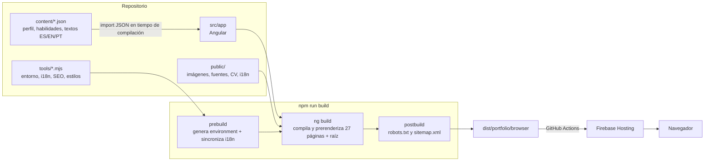

# Visión general

## Qué es

Es el portafolio profesional de Joel Guerrero, arquitecto tecnológico enfocado en cloud y software para el sector financiero. El sitio presenta su perfil, su trayectoria laboral, dos proyectos propios (SmartFinance Pty y SmartPOS Pty), sus habilidades, una vista resumida pensada para reclutadores y una página de contacto con el CV descargable.

Está disponible en tres idiomas: español, inglés y portugués. El idioma forma parte de la URL (`/es`, `/en`, `/pt`) y cada combinación de idioma y página existe como HTML estático generado en el build.

No hay backend propio, ni login, ni formularios que envíen datos. Todo el contenido sale de archivos JSON que viven en el repositorio.

## Pantallas

| Ruta                    | Página              | Para qué sirve                                                                                        |
| ----------------------- | ------------------- | ----------------------------------------------------------------------------------------------------- |
| `/:lang`                | Inicio              | Hero con titular, botones a proyectos, CV y vista reclutador; tecnologías clave; misiones destacadas. |
| `/:lang/experience`     | Experiencia         | Línea de tiempo con empleadores, periodos y progresión de cargos.                                     |
| `/:lang/projects`       | Proyectos           | Listado de proyectos con estado (publicado / en construcción).                                        |
| `/:lang/projects/:slug` | Detalle de proyecto | Rol, enlaces confirmados, tecnologías, decisiones de arquitectura.                                    |
| `/:lang/skills`         | Habilidades         | Grupos de habilidades, progreso de "misiones" visitadas y una terminal de comandos.                   |
| `/:lang/recruiter`      | Vista reclutador    | Todo lo importante en una sola pantalla: rol, años, correo, stack, educación, CV.                     |
| `/:lang/contact`        | Contacto            | Correo, redes sociales y descarga del CV.                                                             |
| `/:lang/not-found`      | 404                 | Página de error traducida.                                                                            |

## Stack

| Pieza                     | Versión (según `package.json`) | Papel                                                                           |
| ------------------------- | ------------------------------ | ------------------------------------------------------------------------------- |
| Angular                   | 22.1                           | Framework. Componentes standalone, signals, control flow nuevo (`@if`, `@for`). |
| `@angular/ssr`            | 22.1.8                         | Prerender de todas las rutas en build (`outputMode: "static"`).                 |
| `@jsverse/transloco`      | 8.4.0                          | Motor de traducciones.                                                          |
| `@ng-icons/feather-icons` | 36.0.0                         | Iconos SVG de Feather.                                                          |
| TypeScript                | 6.0                            | Modo estricto completo.                                                         |
| Vitest + jsdom            | 4.0 / 28                       | Tests unitarios y de integración vía `ng test`.                                 |
| ESLint + angular-eslint   | 10 / 22.5                      | Lint de TypeScript y plantillas, incluidas reglas de accesibilidad.             |
| Stylelint                 | 17.15                          | Lint de SCSS con una regla propia (`portfolio/rem-flow`).                       |
| Prettier                  | 3.8                            | Formato.                                                                        |
| Firebase Hosting          | —                              | Hosting estático. Despliegue con GitHub Actions.                                |

Node probado: **24.21.0** con npm **12.0.2**. El campo `engines` de `package.json` admite `^22.22.3 || ^24.15.0 || >=26.0.0`.

El paquete `firebase` (SDK web) está en las dependencias, pero hoy ningún archivo de `src/` lo importa. Firebase solo se usa como hosting. Más detalle en [Deuda técnica](16-deuda-tecnica.md).

## Vista de pájaro

Lo que conviene retener de este diagrama:

- **El contenido se compila dentro del bundle.** Los JSON de `content/` se importan como módulos TypeScript. No hay peticiones HTTP para obtener textos o datos.
- **Cada página existe como HTML.** El build ejecuta la aplicación en Node para las 27 rutas (9 páginas × 3 idiomas) y guarda el resultado. El navegador recibe HTML completo y Angular lo hidrata.
- **Los scripts de `tools/` rodean al build.** Antes generan el archivo de entorno y validan traducciones; después generan `robots.txt` y `sitemap.xml`.

## Principios que guían el código

Leyendo el código y los tests se ven unas cuantas reglas que se repiten en todo el proyecto. Vale la pena tenerlas presentes:

1. **No inventar datos.** Si un enlace no está confirmado, en el JSON es `null` y la interfaz muestra "enlace pendiente" en lugar de un `href="#"`. Los tests comprueban que no aparezcan certificaciones, métricas ni fechas que no estén en el contenido.
2. **La URL manda.** El idioma sale de la URL, nunca de `localStorage` ni del navegador.
3. **Fallar pronto con contenido inválido.** El mapper del perfil lanza excepciones si una URL no es HTTPS, si un slug está repetido o si una ruta de asset intenta salir de `/assets/`. Mejor romper el build que publicar algo incorrecto.
4. **Accesibilidad como requisito.** Skip link, `aria-current`, regiones `aria-live`, foco gestionado al navegar y reglas de accesibilidad activadas en ESLint.
5. **Un componente, tres archivos.** Cada componente tiene su `.ts`, `.html` y `.scss` en su propia carpeta. Hay un script que lo verifica.
