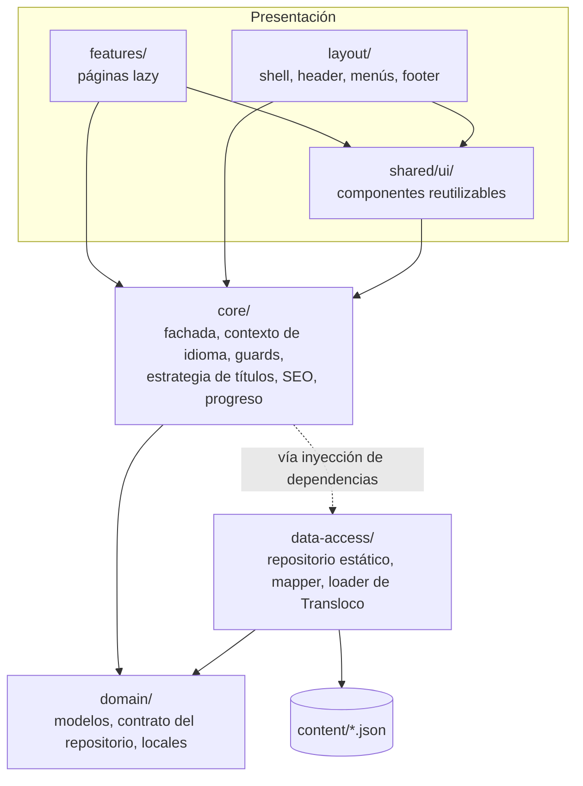
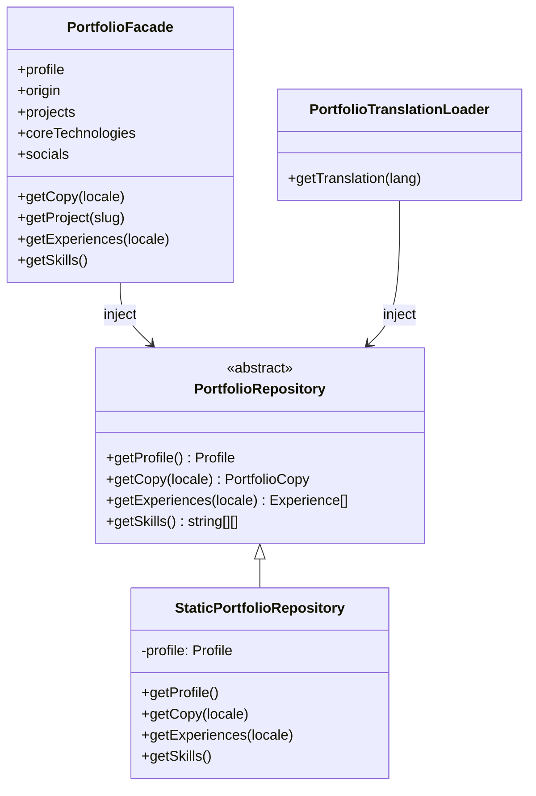
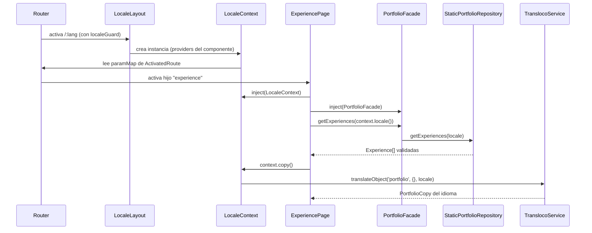

# Arquitectura por capas

`src/app` se divide en cinco carpetas que funcionan como capas. La idea es sencilla: las capas de arriba conocen a las de abajo, nunca al revés. Así, cambiar de dónde vienen los datos (JSON hoy, quizá Firestore mañana) no obliga a tocar ni un componente.

## Las capas



| Capa          | Qué contiene                                                                                                                                                       | Puede importar de             |
| ------------- | ------------------------------------------------------------------------------------------------------------------------------------------------------------------ | ----------------------------- |
| `domain`      | Tipos (`Profile`, `Project`, `Experience`, `PortfolioCopy`), la clase abstracta `PortfolioRepository`, la lista de idiomas y `resolveOrigin`.                      | Nada de la app.               |
| `data-access` | La implementación concreta del repositorio, el mapper que valida el perfil y el loader que conecta el contenido con Transloco.                                     | `domain`, `content/`          |
| `core`        | Servicios de aplicación: `PortfolioFacade`, `LocaleContext`, `LanguageService`, guards, `LocalizedTitleStrategy`, `SeoTags`, `MissionProgress`, providers de i18n. | `domain`, `data-access`\*     |
| `shared/ui`   | Piezas visuales sin conocimiento de rutas concretas: botón, icono, encabezados, tarjeta de proyecto, lista de misiones.                                            | `core`, `domain`              |
| `layout`      | El marco de la aplicación: shell, header, sidebar, menú móvil, footer, selector de idioma.                                                                         | `core`, `shared/ui`, `domain` |
| `features`    | Una carpeta por página. Cada una se carga de forma diferida.                                                                                                       | `core`, `shared/ui`, `domain` |

\* `core/i18n.providers.ts` importa `PortfolioTranslationLoader` de `data-access` para registrarlo en Transloco. Es el único punto donde `core` referencia una clase concreta de `data-access`, y lo hace solo para cablear providers.

## Inversión de dependencias en el acceso a datos

El detalle que sostiene toda la separación está en `app.config.ts`:

```ts
{ provide: PortfolioRepository, useExisting: StaticPortfolioRepository }
```

`PortfolioRepository` es una clase abstracta definida en `domain`. Nadie fuera de `app.config.ts`, `app.config.server.ts` (por herencia) y los tests sabe que la implementación real es `StaticPortfolioRepository`. La fachada, el loader de traducciones y las rutas del servidor piden `PortfolioRepository` y reciben lo que esté configurado.



Se usa una clase abstracta en lugar de una interfaz más un `InjectionToken` porque en Angular una clase abstracta sirve a la vez de tipo y de token. Es menos código y el autocompletado funciona igual.

Si mañana el contenido pasa a Firestore, el trabajo sería escribir un `FirestorePortfolioRepository` que extienda la clase abstracta y cambiar esa línea. Hay que tener en cuenta que el contrato actual es **síncrono** (devuelve valores, no `Observable` ni `Promise`), así que una fuente remota obligaría a cambiar la firma. Está explicado en [Decisiones técnicas](15-decisiones-tecnicas.md).

## Cómo circula la información en una página

Tomemos la página de experiencia como ejemplo. Casi todas las páginas siguen este mismo patrón.



Dos cosas se combinan en cada pantalla:

- **Textos de interfaz** (`context.copy()`): títulos, etiquetas, mensajes. Vienen de Transloco.
- **Datos del perfil** (`portfolio.profile`, `portfolio.projects`, `portfolio.getExperiences()`): vienen de la fachada.

Ambos son reactivos a través de `computed`, así que cuando la URL cambia de `/es/experience` a `/pt/experience`, Angular reutiliza los componentes y solo se recalculan las señales.

## Componentes de clase standalone, sin NgModules

No hay ni un `NgModule` en el proyecto. Cada componente declara sus `imports` y la aplicación arranca con `bootstrapApplication`. Los servicios usan el decorador `@Service()` de Angular 22, que registra la clase en el inyector raíz. La excepción es `LocaleContext`, marcado con `@Service({ autoProvided: false })` para que no exista a nivel raíz y se cree solo dentro de `LocaleLayout`. Por qué importa eso se explica en [Servicios de core](08-servicios-core.md#localecontext).
