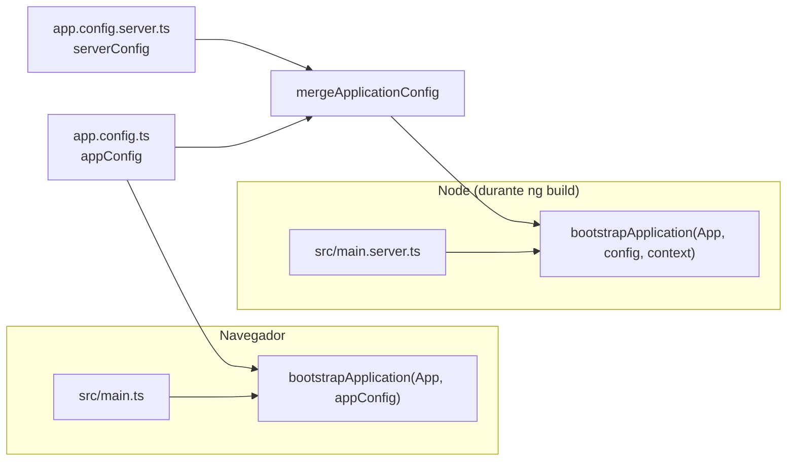

# Arranque y configuración

## Dos puntos de entrada

La aplicación arranca en dos sitios distintos con la misma raíz (`App`) y casi la misma configuración.



### `src/main.ts`

Arranca en el navegador. Si el arranque falla, el error va a `console.error`. Es el archivo generado por el CLI sin cambios.

### `src/main.server.ts`

Exporta una función que recibe el `BootstrapContext` que le pasa `@angular/ssr`. El builder la llama una vez por cada ruta a prerenderizar. No hay servidor Express: con `outputMode: "static"` este archivo solo se usa en tiempo de build.

### `src/app/app.config.ts`

```ts
providers: [
  provideBrowserGlobalErrorListeners(),
  provideRouter(routes, withComponentInputBinding()),
  provideClientHydration(withEventReplay()),
  providePortfolioI18n(),
  { provide: PortfolioRepository, useExisting: StaticPortfolioRepository },
];
```

| Provider                                             | Qué aporta                                                                                                                                                                                                                         |
| ---------------------------------------------------- | ---------------------------------------------------------------------------------------------------------------------------------------------------------------------------------------------------------------------------------- |
| `provideBrowserGlobalErrorListeners()`               | Captura errores no manejados y promesas rechazadas y los pasa al `ErrorHandler` de Angular.                                                                                                                                        |
| `provideRouter(routes, withComponentInputBinding())` | Router con la tabla de `app.routes.ts`. `withComponentInputBinding` hace que el parámetro `:slug` llegue como `input()` a `ProjectDetailPage`.                                                                                     |
| `provideClientHydration(withEventReplay())`          | El navegador reutiliza el DOM prerenderizado en vez de pintarlo de nuevo. Los clics que ocurren antes de que Angular termine de cargar se guardan y se reproducen.                                                                 |
| `providePortfolioI18n()`                             | Transloco con el loader propio y la `TitleStrategy` personalizada. Ver [Internacionalización](06-internacionalizacion.md).                                                                                                         |
| `PortfolioRepository → StaticPortfolioRepository`    | Enlaza el contrato abstracto con la implementación basada en JSON. Se usa `useExisting` porque `StaticPortfolioRepository` ya está registrado en el inyector raíz por `@Service()`; así ambos tokens apuntan a la misma instancia. |

`zone.js` no está entre las dependencias ni se carga en ningún sitio: la aplicación funciona sin zonas, que es el modo por defecto en las versiones recientes de Angular. La detección de cambios la disparan las señales, los eventos de plantilla y el router.

### `src/app/app.config.server.ts`

Añade `provideServerRendering(withRoutes(serverRoutes))` y lo mezcla con `appConfig`. `serverRoutes` está en `app.routes.server.ts` y decide qué rutas se prerenderizan. Ver [Enrutamiento](05-enrutamiento.md#prerender-approutesserverts).

### `src/app/app.ts`

El componente raíz no hace nada salvo contener un `<router-outlet />`. Su SCSS lo convierte en `display: grid` para que el shell pueda ocupar el ancho disponible.

### `src/index.html`

Documento base que usan tanto el prerender como el navegador:

- `lang="es"` por defecto. `LanguageService.commit()` lo cambia en cada navegación.
- Metadatos por defecto: descripción, autor, `robots`, `color-scheme: dark`, `theme-color`, Open Graph y Twitter Card básicos. `LocalizedTitleStrategy` sobrescribe título, descripción y `og:*` por página.
- `<link rel="preload">` de la fuente Manrope, que es la que se ve primero, para que el texto no parpadee al cargar.
- Referencia a `favicon.ico`. Ojo: no hay `favicon.ico` en `public/`, así que esa petición da 404.

## `angular.json`

Un único proyecto, `portfolio`, con estas claves relevantes:

| Clave                                         | Valor                                                                             | Por qué                                                                                        |
| --------------------------------------------- | --------------------------------------------------------------------------------- | ---------------------------------------------------------------------------------------------- |
| `schematics.@schematics/angular:component`    | `style: scss`, `inlineTemplate: false`, `inlineStyle: false`, `flat: false`       | Que `ng generate component` cree siempre carpeta propia con tres archivos.                     |
| `build.builder`                               | `@angular/build:application`                                                      | Builder moderno basado en esbuild/Vite.                                                        |
| `build.options.server`                        | `src/main.server.ts`                                                              | Activa el renderizado en servidor.                                                             |
| `build.options.outputMode`                    | `static`                                                                          | Solo prerender. No genera servidor Node para producción.                                       |
| `build.options.assets`                        | todo `public/`                                                                    | Imágenes, fuentes, CV e i18n se copian a la raíz de la salida.                                 |
| `configurations.production.budgets`           | inicial 500 kB aviso / 1 MB error; estilos por componente 4 kB aviso / 8 kB error | Evita que el bundle crezca sin que nadie lo note.                                              |
| `configurations.production.outputHashing`     | `all`                                                                             | Nombres con hash para cachear agresivamente en el CDN.                                         |
| `configurations.development.fileReplacements` | `environment.ts` → `environment.development.ts`                                   | Patrón clásico de entornos. Hoy ningún archivo importa `environment`, así que no tiene efecto. |
| `serve.defaultConfiguration`                  | `development`                                                                     | `ng serve` compila sin optimizar y con source maps.                                            |
| `test.builder`                                | `@angular/build:unit-test`                                                        | Ejecuta Vitest con jsdom.                                                                      |
| `cli.analytics`                               | un UUID                                                                           | El CLI tiene activada la telemetría anónima de Angular.                                        |

## TypeScript

`tsconfig.json` activa todo lo estricto que ofrece TypeScript y Angular:

- `strict`, `noImplicitOverride`, `noImplicitReturns`, `noFallthroughCasesInSwitch`.
- `noUncheckedIndexedAccess`: acceder a `array[0]` devuelve `T | undefined`. Por eso en las plantillas verás cosas como `context.copy().headline[0] ?? ''`.
- `noPropertyAccessFromIndexSignature`: obliga a escribir `route.data['page']` en lugar de `route.data.page`.
- `resolveJsonModule` + `esModuleInterop`: permiten `import profile from '../../../content/profile.json'`.
- `strictTemplates`, `strictInjectionParameters`, `strictInputAccessModifiers`: los errores de plantilla se detectan al compilar.
- `target: ES2022`, `module: preserve`.

`tsconfig.app.json` compila `src/**/*.ts` sin los specs y con `types: []`. `tsconfig.spec.json` incluye solo specs y añade `vitest/globals`, que es lo que permite usar `describe`, `it`, `expect` y `vi` sin importarlos.

## ESLint

`eslint.config.mjs` usa el formato flat:

- Para `src/**/*.ts`: reglas recomendadas de ESLint, `typescript-eslint` y `angular-eslint`. El procesador `processInlineTemplates` extrae plantillas inline, aunque el proyecto no las usa.
- Para `src/**/*.html`: `templateRecommended` y `templateAccessibility`. La segunda comprueba, por ejemplo, que las imágenes tengan `alt` y que los elementos interactivos sean accesibles por teclado.

La configuración de Stylelint es más particular y tiene su propio documento: [Estilos y contrato CSS](11-estilos.md).
