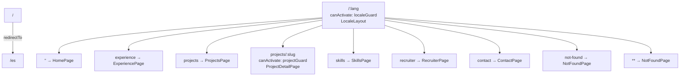
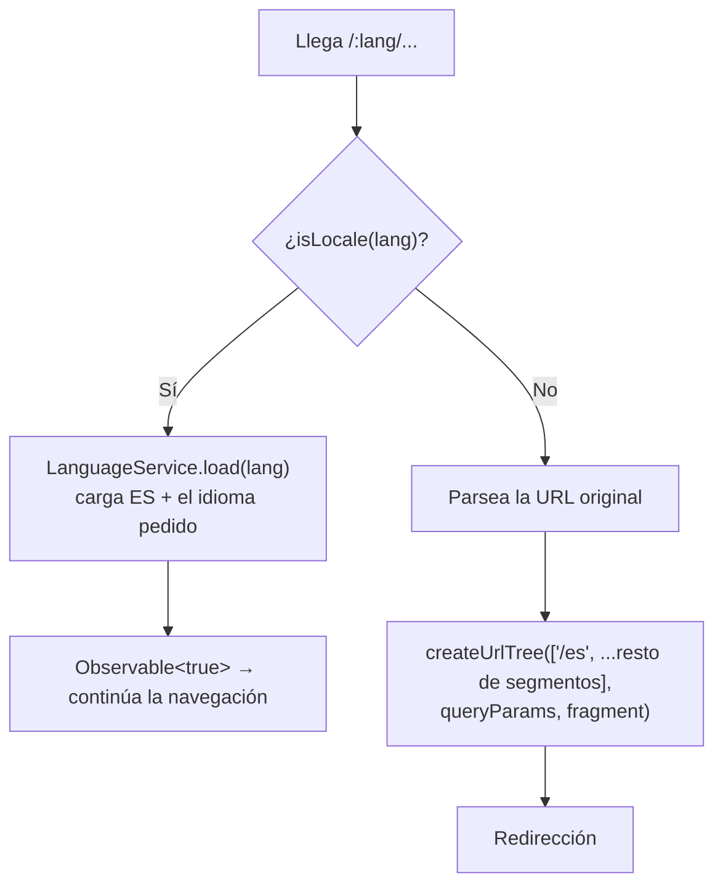
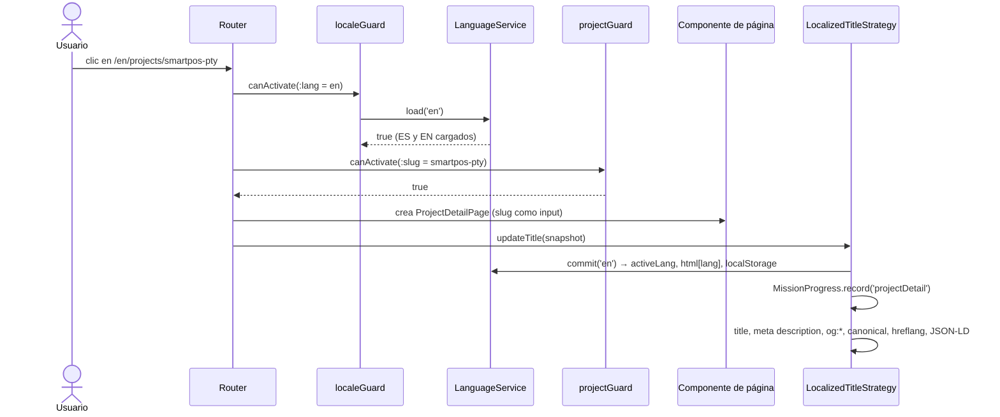

# Enrutamiento y prerender

Hay dos tablas de rutas. `app.routes.ts` dice qué componente se muestra en cada URL. `app.routes.server.ts` dice cómo se renderiza cada URL durante el build.

## Tabla de rutas del cliente (`app.routes.ts`)



Todas las rutas usan `loadComponent` con `import()` dinámico, así que cada página es un chunk JavaScript aparte que solo se descarga cuando hace falta. `LocaleLayout` también se carga de forma diferida.

Cada ruta hija lleva `data: { page: '…' satisfies PageKey }`. `PageKey` es `keyof PortfolioCopy['seo']`, es decir, las claves de la sección `seo` de los textos. El `satisfies` hace que TypeScript falle si alguien escribe una clave que no existe. `LocalizedTitleStrategy` lee ese valor para saber qué título y descripción poner.

### Por qué el idioma es un parámetro y no tres árboles de rutas

La alternativa sería tener `es/…`, `en/…` y `pt/…` como rutas separadas. Con `:lang` hay una sola definición y el guard decide si el valor es válido. Además, al cambiar de `/es/projects` a `/en/projects` el router **reutiliza** los componentes (misma configuración de ruta, distinto parámetro) y solo cambian las señales que dependen del idioma. Hay un test para esto en `app.spec.ts`: _updates content when the language route is reused_.

## Guards

### `localeGuard` (`core/locale.guard.ts`)



Si el idioma es válido, el guard no deja pasar hasta que las traducciones estén cargadas. Así ninguna página llega a pintarse con claves sin traducir.

Si no es válido, reconstruye la URL cambiando solo el primer segmento. `/fr/projects?source=cv#architecture` acaba en `/es/projects?source=cv#architecture`. Esto importa porque el CV en PDF y los enlaces compartidos pueden llevar parámetros de seguimiento que no deben perderse.

Consecuencia curiosa: una URL como `/proyectos` no da 404. `proyectos` se interpreta como un idioma inválido y se redirige a `/es`. Solo las rutas desconocidas **dentro** de un idioma válido (`/en/missing`) llegan a la página 404.

### `projectGuard` (`core/project.guard.ts`)

Busca el slug con `PortfolioFacade.getProject()`. Si existe, deja pasar. Si no, redirige a `/:lang/not-found` usando el idioma del padre (o `es` si por algún motivo no fuera válido). Gracias a esto `ProjectDetailPage` puede asumir que el proyecto existe, aunque por prudencia su plantilla igual envuelve todo en `@if (project(); as item)`.

## Prerender (`app.routes.server.ts`)

```ts
const sections = [
  "",
  "experience",
  "projects",
  "skills",
  "recruiter",
  "contact",
  "not-found",
];
```

| Ruta del servidor           | Modo                           | Parámetros que genera                                                                         |
| --------------------------- | ------------------------------ | --------------------------------------------------------------------------------------------- |
| `''`                        | `Prerender`                    | La raíz. Como redirige a `/es`, el builder escribe un HTML con `<meta http-equiv="refresh">`. |
| `:lang` y `:lang/<sección>` | `Prerender`, fallback `Client` | `LOCALES.map(lang => ({ lang }))` → 3 por sección.                                            |
| `:lang/projects/:slug`      | `Prerender`, fallback `Client` | Cada idioma × cada slug de `profile.json` → 6.                                                |
| `**`                        | `Client`                       | Nada. Cualquier otra ruta se resuelve en el navegador.                                        |

Total: 7 secciones × 3 idiomas + 2 proyectos × 3 idiomas = **27 páginas**, más la raíz. `tools/i18n/check-prerender.mjs` comprueba que sean exactamente 27.

`getPrerenderParams` para los proyectos usa `inject(PortfolioRepository)`: se ejecuta dentro del contexto de inyección de la aplicación, así que obtiene la lista real de slugs. Añadir un proyecto en `profile.json` basta para que se prerenderice.

`PrerenderFallback.Client` significa que si en algún momento se pidiera una combinación no prerenderizada, el hosting entregaría el shell y Angular renderizaría en el navegador.

### Qué se genera en `dist/`

```text
dist/portfolio/browser/
├── index.html                  # redirección a /es
├── es/index.html
├── es/experience/index.html
├── es/projects/index.html
├── es/projects/smartfinance-pty/index.html
├── ...                         # lo mismo para en/ y pt/
├── index.csr.html              # shell vacío para renderizado solo en cliente
├── robots.txt / sitemap.xml    # los añade postbuild
├── i18n/, assets/              # copiados de public/
└── *.js, *.css                 # chunks con hash
```

## Ciclo completo de una navegación



`TitleStrategy.updateTitle` se ejecuta al final de cada navegación exitosa, también durante el prerender. Por eso se usa como punto central para todo lo que depende de "en qué página estoy": no solo el título. Ver [Servicios de core](08-servicios-core.md#localizedtitlestrategy).

## Añadir una página nueva

1. Crea la carpeta en `src/app/features/<nombre>/` con `<nombre>.page.ts`, `.html` y `.scss`.
2. Añade la clave de la página en la sección `seo` de `content/es.json`, `en.json` y `pt.json`, y en la interfaz `PortfolioCopy['seo']`.
3. Añade la descripción correspondiente al objeto `descriptions` de `LocalizedTitleStrategy.updateTitle`. TypeScript te obligará, porque el objeto usa `satisfies Record<PageKey, string>`.
4. Registra la ruta hija en `app.routes.ts` con su `data.page`.
5. Añade la sección al array `sections` de `app.routes.server.ts` para que se prerenderice.
6. Si debe aparecer en el menú, añádela a `sections` en `NavigationLinks` y su etiqueta al array `nav` de los tres JSON (el índice debe coincidir).
7. Si debe contar como "misión", añádela a `MISSION_SECTIONS` en `mission-progress.ts`.
8. Ajusta `tools/i18n/check-prerender.mjs`: la lista `definitions` y el total esperado de páginas.
9. `npm run sync:i18n`, `npm test`, `npm run build` y `npm run check:prerender`.
