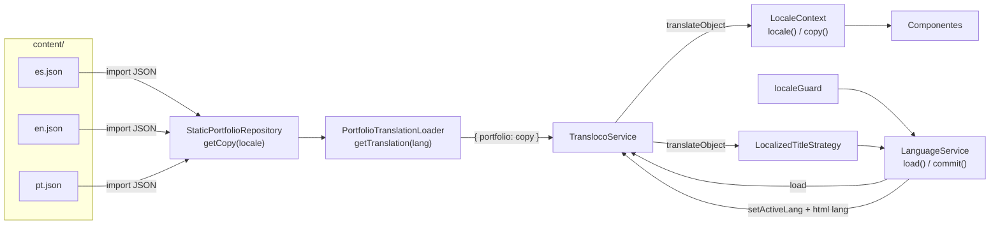
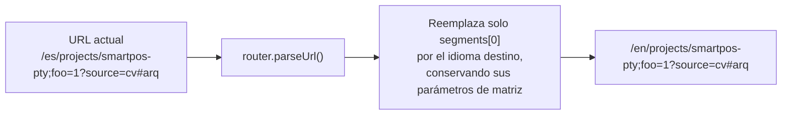

# Internacionalización

El sitio existe en español (`es`), inglés (`en`) y portugués (`pt`). El español es el idioma por defecto y el de respaldo.

## La regla de oro: la URL decide

El idioma activo es siempre el primer segmento de la URL. No se detecta el idioma del navegador y la preferencia guardada en `localStorage` no se lee nunca para decidir nada. Se guarda (clave `portfolio.locale`), pero solo como dato informativo.

¿Por qué tan estricto? Porque el sitio se prerenderiza. `/en/projects` es un archivo HTML en inglés que Google indexa y que alguien comparte en LinkedIn. Si al abrirlo el navegador cambiara a español porque "la última vez elegiste español", el contenido indexado y el mostrado no coincidirían, y el enlace compartido dejaría de ser fiable. Hay un test específico que guarda `pt` en `localStorage`, abre `/en/…` y comprueba que se muestra inglés.

## Piezas y cómo encajan



### `providePortfolioI18n()` (`core/i18n.providers.ts`)

Configura Transloco y registra la estrategia de títulos:

| Opción                         | Valor                                                                      | Motivo                                                                          |
| ------------------------------ | -------------------------------------------------------------------------- | ------------------------------------------------------------------------------- |
| `availableLangs`               | `['es', 'en', 'pt']`                                                       | Sale de `LOCALES`, la única lista de idiomas del proyecto.                      |
| `defaultLang` / `fallbackLang` | `'es'`                                                                     | Si faltara una clave en otro idioma, se muestra en español.                     |
| `reRenderOnLangChange`         | `true`                                                                     | Las plantillas se actualizan al cambiar de idioma sin recargar.                 |
| `prodMode`                     | `!isDevMode()`                                                             | Silencia avisos de Transloco en producción.                                     |
| `failedRetries`                | `0`                                                                        | El loader es síncrono y en memoria; si falla, reintentar no ayuda.              |
| `missingHandler`               | `allowEmpty: false`, `useFallbackTranslation: true`, `logMissingKey: true` | Una cadena vacía cuenta como ausente, se usa el español y se avisa por consola. |

### `PortfolioTranslationLoader` (`data-access/portfolio-translation.loader.ts`)

Implementa `TranslocoLoader`. En lugar de hacer una petición HTTP a `/i18n/es.json`, como haría el loader típico, pide el objeto al repositorio y lo envuelve en `{ portfolio: … }`. Todas las claves quedan bajo el espacio `portfolio`.

Si el idioma no es válido, devuelve un `Observable` que falla. Esto evita que alguien consiga que el loader haga una petición a una URL arbitraria construida con el idioma. Hay un test para ello.

Ventajas de cargar desde memoria:

- Cero peticiones de red para los textos.
- En el prerender los textos están disponibles de forma síncrona, así que el HTML generado ya sale traducido.
- TypeScript comprueba la forma de los JSON (ver abajo).

El coste es que los tres idiomas viajan en el bundle aunque solo se use uno. Con el volumen actual de texto es despreciable.

### `LanguageService` (`core/language.service.ts`)

Dos métodos, con responsabilidades separadas a propósito:

- **`load(locale)`**: carga el idioma por defecto y el pedido con `forkJoin` y devuelve `Observable<true>`. Lo usa `localeGuard`. Se carga siempre también el español porque es el idioma de respaldo.
- **`commit(locale)`**: fija el idioma activo en Transloco, cambia `<html lang>` y, solo en el navegador, guarda la preferencia en `localStorage`. El acceso a `localStorage` va en `try/catch` porque en modo privado de algunos navegadores o con el almacenamiento bloqueado lanza una excepción. Lo llama `LocalizedTitleStrategy` al final de cada navegación.

La separación existe porque cargar puede ocurrir para navegaciones que luego se cancelan (otro guard redirige, por ejemplo), mientras que confirmar solo debe pasar cuando la navegación termina de verdad.

### `LocaleContext` (`core/locale-context.ts`)

Es lo que usan los componentes. Expone dos señales:

- `locale()`: el idioma leído de `ActivatedRoute.paramMap`. Si el valor no es válido (no debería pasar, porque el guard lo impide) devuelve `es`.
- `copy()`: el objeto `PortfolioCopy` completo del idioma actual, obtenido con `translateObject('portfolio', {}, locale)`.

Los componentes escriben `context.copy().experienceTitle` en vez de usar el pipe `transloco`. Así el acceso está tipado: si una clave no existe en `PortfolioCopy`, la compilación falla.

### Selector de idioma (`layout/language-switcher`)

Genera un enlace por idioma que conserva todo lo demás de la URL actual:



Los enlaces se recalculan con cada `NavigationEnd`. El desplegable se cierra al hacer clic fuera, al pulsar Escape (devolviendo el foco al botón) o al elegir un idioma. Cada enlace lleva `hreflang` y un `aria-label` del tipo "EN · Cambiar a inglés" en el idioma actual.

## Los archivos de textos

### Dónde se editan

En `content/es.json`, `content/en.json` y `content/pt.json`. **Nunca** en `public/i18n/`.

### Forma

Los tres archivos tienen exactamente la misma estructura, descrita en la interfaz `PortfolioCopy` (`domain/portfolio-copy.ts`). Algunos detalles que no son obvios:

- `nav` es un array de 5 etiquetas cuyo orden debe coincidir con `sections` de `NavigationLinks`: Inicio, Experiencia, Proyectos, Habilidades, Contacto. La etiqueta de "Reclutador" va aparte en `recruiter`.
- `skillLabels` es un array de 6 etiquetas cuyo orden debe coincidir con los 6 grupos de `content/skills.json`.
- `headline` son dos líneas: la segunda se pinta con color de acento en el hero.
- `jobs` es la experiencia laboral. Vive aquí, y no en `profile.json`, porque cargos, resúmenes y meses están traducidos.
- `seo` tiene el título de cada página; sus claves son los `PageKey` usados en las rutas.

### Comprobación de tipos

En `static-portfolio.repository.ts`:

```ts
const copies = { es, en, pt } satisfies Record<Locale, PortfolioCopy>;
```

Si a `pt.json` le falta una clave que `PortfolioCopy` exige, `npm run typecheck` falla. Es una red de seguridad en tiempo de compilación, antes incluso de ejecutar los tests.

### Validación en scripts

`tools/i18n/catalog.mjs` aplica reglas que TypeScript no puede comprobar:

- Los tres idiomas tienen exactamente las mismas claves y arrays del mismo tamaño.
- Ningún valor está vacío.
- Ningún valor es igual a su propia clave (`"nav.0": "nav.0"`), señal típica de texto sin traducir.
- Las interpolaciones `{{ algo }}` coinciden entre idiomas.

### La copia en `public/i18n`

`npm run sync:i18n` copia `content/*.json` a `public/i18n/*.json`. `npm run check:i18n` falla si las copias no son idénticas. El `prebuild` hace ambas cosas, así que un build siempre publica copias frescas.

Conviene saber que la aplicación **no lee** esas copias en ejecución: el loader toma los textos del bundle. Quedan publicadas en `dist/portfolio/browser/i18n/` como diccionarios accesibles por URL. Ver [Deuda técnica](16-deuda-tecnica.md).

## Añadir un idioma

1. Añade el código a `LOCALES` en `domain/locale.ts`.
2. Crea `content/<código>.json` copiando `es.json` y traduciendo.
3. Añade las claves del nuevo idioma en `languageNames` y `switchLanguage` de **todos** los JSON, y en la interfaz `PortfolioCopy`.
4. Importa el JSON en `static-portfolio.repository.ts` y añádelo a `copies`.
5. Añade el idioma a los arrays `locales` de `tools/i18n/check-i18n.mjs`, `check-prerender.mjs` y `catalog.mjs`.
6. Actualiza el total de páginas esperado en `check-prerender.mjs`.
7. `npm run sync:i18n`, tests, build y `check:prerender`.
