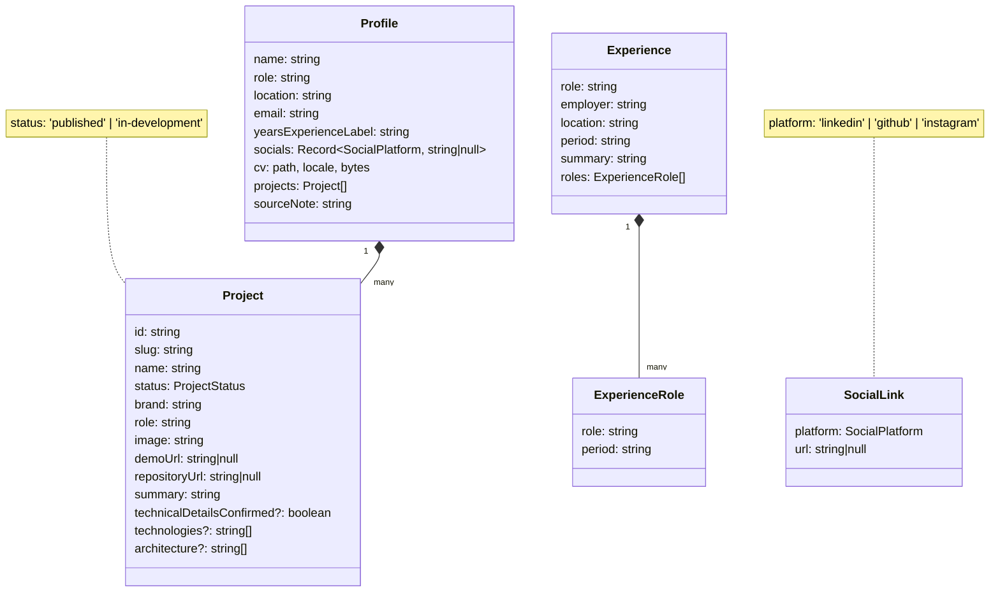

# Contenido y datos

Todo lo que el sitio cuenta sale de `content/`. No hay base de datos ni API. Los archivos se importan como módulos en tiempo de compilación, se validan al construir el repositorio y se sirven a la interfaz a través de la fachada.

## Archivos de `content/`

| Archivo         | Contenido                                                                                                     | Lo lee                                               |
| --------------- | ------------------------------------------------------------------------------------------------------------- | ---------------------------------------------------- |
| `profile.json`  | Nombre, rol, ubicación, correo, redes, CV (ruta, idioma y tamaño en bytes) y proyectos.                       | `StaticPortfolioRepository` vía `mapProfile`         |
| `skills.json`   | Array de 6 grupos; cada grupo es un array de nombres de tecnologías.                                          | `StaticPortfolioRepository`                          |
| `es/en/pt.json` | Textos de interfaz y experiencia laboral traducida.                                                           | `StaticPortfolioRepository` → Transloco              |
| `site.json`     | `origin` y `firebaseProjectId` para construir URLs absolutas (SEO). `note` es un comentario para quien edite. | `PortfolioFacade` y `tools/seo/generate-sitemap.mjs` |

## Modelo de datos

Todos los campos son `readonly`. Los datos no se modifican en ejecución.

Un detalle de diseño: el perfil y los proyectos están en español en `profile.json`, pero la interfaz nunca muestra `project.summary` ni `project.role` en otro idioma. Para los dos proyectos conocidos, los componentes usan textos traducidos (`financeDesc`, `posDetail`, `architect`, etc.) según el `id`. Los campos del JSON quedan como respaldo para un proyecto nuevo que aún no tenga textos traducidos. `check-prerender.mjs` verifica que el `summary` en español no aparezca en las páginas en inglés o portugués.

## Validación: `mapProfile` (`data-access/profile.mapper.ts`)

`profile.json` pasa por `mapProfile` antes de que nadie lo use. La función lanza una excepción, y por tanto rompe el arranque y el build, si:

| Regla                                                                          | Qué protege                                                                                           |
| ------------------------------------------------------------------------------ | ----------------------------------------------------------------------------------------------------- |
| `cv.locale` no es un idioma soportado                                          | Que la nota "CV original en español" sea cierta.                                                      |
| `cv.bytes` no es un entero positivo                                            | Que el tamaño mostrado ("87 KB") sea real. `check-prerender` además compara con el archivo en `dist`. |
| Una URL de redes, demo o repositorio no es `https:` o lleva usuario/contraseña | Enlaces `javascript:`, `http:` o con credenciales embebidas.                                          |
| Una ruta de imagen o CV no cumple `^/assets/[a-zA-Z0-9_./-]+$` o contiene `..` | Path traversal y rutas fuera de la carpeta de assets.                                                 |
| Un `status` no es `published` ni `in-development`                              | Estados inventados.                                                                                   |
| Un `slug` no es kebab-case o está repetido                                     | URLs rotas o que colisionan.                                                                          |
| Un `id` está vacío o repetido                                                  | Claves de `@for … track project.id` duplicadas.                                                       |

Los valores `null` en URLs son válidos y tienen significado: "este enlace existe pero aún no está confirmado". La interfaz los muestra como "Enlace pendiente".

## `StaticPortfolioRepository` (`data-access/static-portfolio.repository.ts`)

Implementación de `PortfolioRepository` basada en los JSON importados.

| Método                   | Qué devuelve                                                                                                                                                                                                    |
| ------------------------ | --------------------------------------------------------------------------------------------------------------------------------------------------------------------------------------------------------------- |
| `getProfile()`           | El perfil ya validado por `mapProfile`. Se calcula una vez al crear el servicio.                                                                                                                                |
| `getCopy(locale)`        | El JSON de textos del idioma, tal cual.                                                                                                                                                                         |
| `getExperiences(locale)` | `copy.jobs` validado: cada trabajo necesita `role`, `employer`, `period` y `summary`; cada paso de progresión necesita `role` y `period`. Si falta algo lanza `Incomplete experience in content/<locale>.json`. |
| `getSkills()`            | `skills.json` tal cual.                                                                                                                                                                                         |

La validación de experiencia se hace en cada llamada, no al construir el servicio. Como los componentes la invocan dentro de un `computed`, en la práctica se ejecuta al entrar en la página o al cambiar de idioma.

## `PortfolioFacade` (`core/portfolio.facade.ts`)

Es la única puerta de acceso a los datos para los componentes. Añade algo de lógica encima del repositorio:

| Miembro                                  | Qué es                                                                                                                                                                                                                                  |
| ---------------------------------------- | --------------------------------------------------------------------------------------------------------------------------------------------------------------------------------------------------------------------------------------- |
| `profile`                                | El perfil validado.                                                                                                                                                                                                                     |
| `origin`                                 | `resolveOrigin(site.json)`: el dominio público o `null`.                                                                                                                                                                                |
| `projects`                               | Atajo a `profile.projects`.                                                                                                                                                                                                             |
| `coreTechnologies`                       | `['AWS', 'Azure', 'OCI', 'Terraform']`, pero comprobando que cada una exista en `skills.json`. Si alguien la borra de las habilidades, la fachada lanza un error. Así el hero nunca presume de una tecnología que el perfil no declara. |
| `socials`                                | Array ordenado `[linkedin, github, instagram]` con su URL o `null`. Las plantillas iteran este array.                                                                                                                                   |
| `getProject(slug)`                       | El proyecto con ese slug o `undefined`.                                                                                                                                                                                                 |
| `getCopy`, `getExperiences`, `getSkills` | Delegan en el repositorio.                                                                                                                                                                                                              |

## `resolveOrigin` (`domain/site.ts`)

Decide la URL pública del sitio:

1. Si `origin` tiene valor, debe ser HTTPS y se usa su parte de origen (`https://dominio.com`).
2. Si no, pero hay `firebaseProjectId` con formato válido (`[a-z0-9-]+`), se usa `https://<id>.web.app`.
3. Si ninguno tiene valor, devuelve `null` y **no se emiten** canonical, hreflang ni sitemap. La idea es no inventar un dominio que quizá no sea el definitivo.

Hoy `site.json` tiene `origin: "https://portfolio-1a3e7.web.app"`.

## Tareas habituales

**Cambiar un dato del perfil** (correo, rol, redes): edita `content/profile.json`. Si cambias el CV, actualiza también `cv.bytes` con el tamaño exacto del nuevo PDF (`stat -c %s public/assets/cv/Joel_Guerrero_CV.pdf`). `check:prerender` fallará si no coincide.

**Añadir un proyecto**:

1. Añade la imagen en `public/assets/images/`.
2. Añade el objeto en `profile.json` con `id` y `slug` únicos.
3. Para que la interfaz muestre textos traducidos en lugar de los campos en español, hoy hay que añadir claves en los JSON de idioma y ramas por `id` en `ProjectCard`, `ProjectDetailPage` y `LocalizedTitleStrategy`. Es un punto mejorable, explicado en [Deuda técnica](16-deuda-tecnica.md).
4. Ajusta los tests que enumeran los proyectos existentes.

**Añadir una habilidad**: añádela al grupo que corresponda en `skills.json`. Si creas un grupo nuevo, añade su etiqueta a `skillLabels` en los tres idiomas.

**Añadir o cambiar experiencia**: edita `jobs` en los tres JSON de idioma. Los empleadores y periodos deben coincidir entre idiomas; el test `static-portfolio.repository.spec.ts` los fija explícitamente, así que habrá que actualizarlo.
