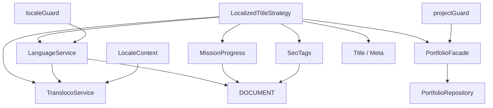
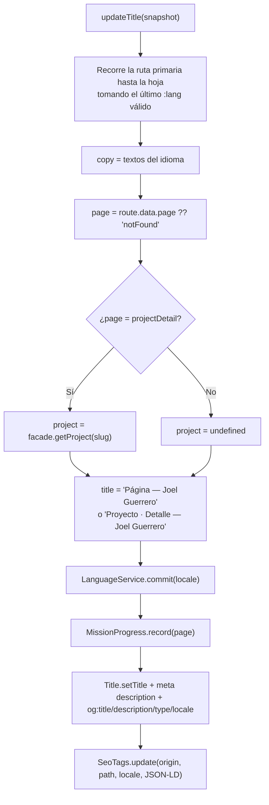

# Servicios de `core`

`core/` contiene la lógica de aplicación que no es visual. Aquí se describe cada clase y función con lo que hace, de quién depende y quién la usa. `PortfolioFacade` y `LanguageService` ya se explicaron en [Contenido y datos](07-contenido-y-datos.md#portfoliofacade-coreportfoliofacadets) y en [Internacionalización](06-internacionalizacion.md#languageservice-corelanguageservicets), así que aquí solo aparecen en el mapa.

## Mapa de dependencias

## `LocaleContext`

**Archivo:** `core/locale-context.ts` · **Ámbito:** una instancia por `LocaleLayout`

Expone `locale()` y `copy()` como señales. Lo inyectan casi todos los componentes.

Lo interesante es su ámbito. Está decorado con `@Service({ autoProvided: false })`, lo que significa que no existe en el inyector raíz. Solo aparece porque `LocaleLayout` lo declara en `providers`. Esto tiene un motivo concreto: `LocaleContext` inyecta `ActivatedRoute`, y el `ActivatedRoute` que recibe un servicio depende de dónde se cree. Creado en `LocaleLayout`, recibe la ruta `:lang`, que es justo la que tiene el parámetro de idioma. Si fuera un singleton raíz, recibiría la ruta raíz y `paramMap.get('lang')` sería siempre `null`.

Todos los componentes descendientes de `LocaleLayout` (el shell, el header, las páginas) comparten la misma instancia.

## `LocalizedTitleStrategy`

**Archivo:** `core/localized-title.strategy.ts` · **Ámbito:** raíz, registrado como `TitleStrategy`

Angular llama a `updateTitle(snapshot)` cuando termina cada navegación. El proyecto aprovecha ese momento para hacer todo lo que depende de la página actual:

La descripción de cada página sale de un texto ya existente (`intro`, `experienceIntro`, `projectsIntro`…). Para los proyectos se usa `financeDetail` o `posDetail` según el `id`.

`structuredData()` construye el JSON-LD: una entidad `Person` siempre y, en la página de proyectos o en un detalle, una `CreativeWork` por proyecto. Los detalles están en [SEO](10-seo.md).

¿Por qué meter todo esto en una `TitleStrategy` y no en un servicio que escuche `NavigationEnd`? Porque la `TitleStrategy` se ejecuta de forma fiable también durante el prerender, dentro del ciclo del router, antes de que el HTML se serialice. Un `subscribe` a eventos del router en un servicio raíz obligaría a instanciarlo a mano y a cuidar el orden. Aquí el router garantiza el momento.

## `SeoTags`

**Archivo:** `core/seo-tags.ts` · **Ámbito:** raíz

Manipula directamente `document.head` para lo que el servicio `Meta` de Angular no cubre:

- `canonical(origin, path)`: crea o actualiza `<link rel="canonical">`. Si no hay origen, lo elimina.
- `alternates(origin, path, locale)`: borra todos los `<link rel="alternate" hreflang>` y los vuelve a crear para `es`, `en`, `pt` y `x-default` (que apunta a español).
- `structuredData(entries)`: crea o actualiza `` no pueda cerrar la etiqueta.

Usa `DOCUMENT` inyectado, no `window.document`, así que funciona igual en el prerender.

## `MissionProgress`

**Archivo:** `core/mission-progress.ts` · **Ámbito:** raíz

Lleva la cuenta de qué secciones del portafolio ha visitado la persona. La página de habilidades lo muestra como "Progreso de misiones: 3 / 6". Es un guiño lúdico: **no bloquea nada**. Todo el contenido es accesible desde el primer momento, y un test lo comprueba.

- `MISSION_SECTIONS`: `home`, `experience`, `projects`, `skills`, `recruiter`, `contact`. El detalle de proyecto cuenta como `projects`; `notFound` no cuenta.
- `record(page)`: añade la sección si no estaba y la persiste en `localStorage` bajo `portfolio.missions` como lista separada por comas.
- `restore()`: se ejecuta en `afterNextRender`, es decir, solo en el navegador y después de la primera renderización. Lee lo guardado, descarta valores desconocidos y lo mezcla con lo ya registrado.
- `storage()`: devuelve `null` en el servidor o si acceder a `localStorage` lanza una excepción. Nunca rompe la navegación por culpa del almacenamiento.

Efecto visible del prerender: como `record()` se llama también en el servidor, el HTML estático de `/es/skills` ya sale con "1 / 6" (la propia página). Al hidratarse, `restore()` suma lo que hubiera guardado. `check-prerender.mjs` verifica ese "1 / 6".

Usa `signal` para el estado y `computed` para exponerlo en solo lectura (`visited`).

## `localeGuard` y `projectGuard`

Son funciones `CanActivateFn`, no clases. Están descritas con diagramas en [Enrutamiento](05-enrutamiento.md#guards).

## `providePortfolioI18n`

Función que devuelve el array de providers de i18n. Descrita en [Internacionalización](06-internacionalizacion.md#provideportfolioi18n-corei18nprovidersts).

## Tabla resumen

| Símbolo                  | Tipo                             | Ámbito         | Usado por                                                 |
| ------------------------ | -------------------------------- | -------------- | --------------------------------------------------------- |
| `PortfolioFacade`        | Servicio                         | Raíz           | Casi todos los componentes, guards, estrategia de títulos |
| `LocaleContext`          | Servicio                         | `LocaleLayout` | Todos los componentes bajo `/:lang`                       |
| `LanguageService`        | Servicio                         | Raíz           | `localeGuard`, `LocalizedTitleStrategy`                   |
| `LocalizedTitleStrategy` | `TitleStrategy`                  | Raíz           | El router                                                 |
| `SeoTags`                | Servicio                         | Raíz           | `LocalizedTitleStrategy`                                  |
| `MissionProgress`        | Servicio                         | Raíz           | `LocalizedTitleStrategy`, `SkillsPage`                    |
| `localeGuard`            | `CanActivateFn`                  | —              | Ruta `:lang`                                              |
| `projectGuard`           | `CanActivateFn`                  | —              | Ruta `projects/:slug`                                     |
| `providePortfolioI18n`   | Función de providers             | —              | `app.config.ts`, tests                                    |
| `PageKey`                | Tipo                             | —              | Rutas, `MissionProgress`, estrategia de títulos           |
| `LOCALE_PREFERENCE_KEY`  | Constante `'portfolio.locale'`   | —              | `LanguageService`, tests                                  |
| `PROGRESS_STORAGE_KEY`   | Constante `'portfolio.missions'` | —              | `MissionProgress`, tests                                  |
