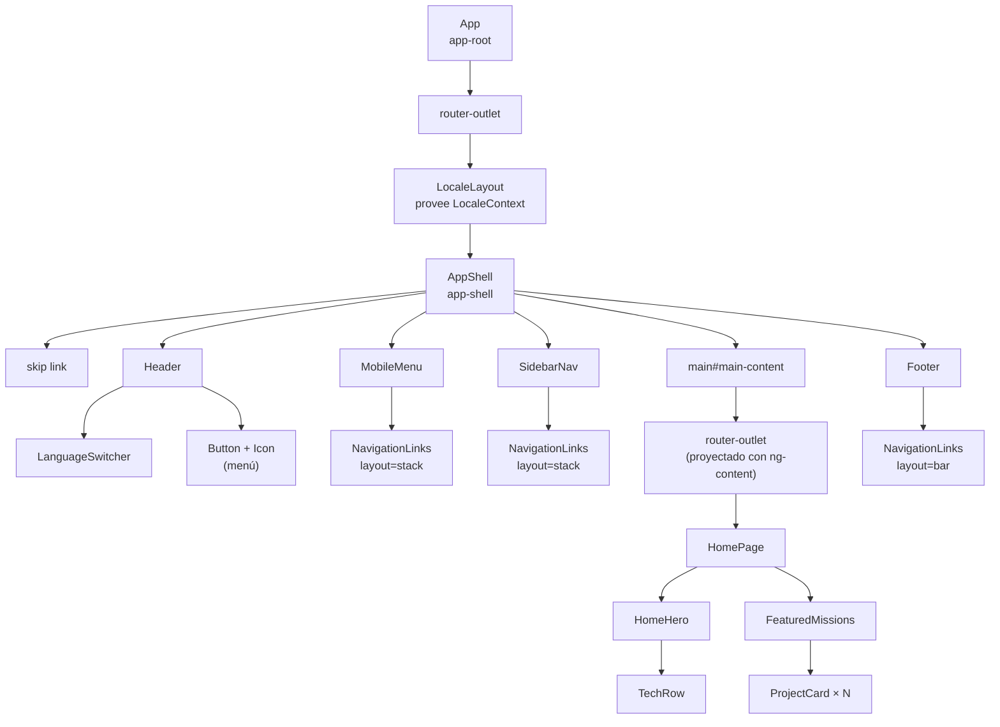
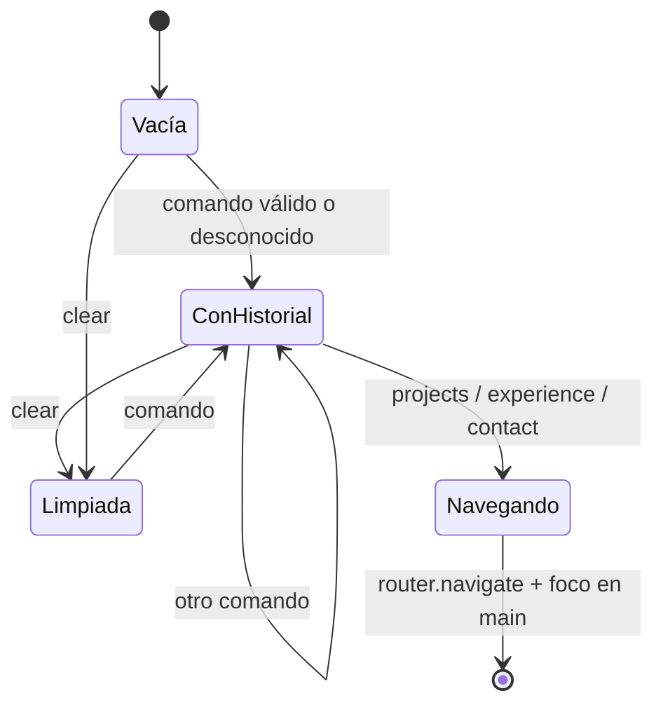

# Componentes

Todos los componentes son standalone, usan `input()`, `output()` y `model()` basados en señales, y el control de flujo nuevo (`@if`, `@for`, `@empty`). Ninguno usa `ChangeDetectionStrategy` explícita ni `NgModule`.

## Árbol de componentes

Así queda el árbol cuando se visita `/es`. Todos estos componentes existen en el DOM en cualquier tamaño de pantalla; es el CSS el que decide cuáles se ven.



No todo se ve a la vez. El punto de corte principal es `64em` (1024 px con la fuente por defecto):

| Pieza                        | Por debajo de 64em    | Desde 64em                                 |
| ---------------------------- | --------------------- | ------------------------------------------ |
| `SidebarNav`                 | Oculta                | Visible, columna fija a la izquierda       |
| `MobileMenu` y botón de menú | Visibles              | Ocultos                                    |
| `LanguageSwitcher`           | Botón con desplegable | Los tres idiomas en línea, sin desplegable |

`LocaleLayout` pone un `<router-outlet>` **dentro** de `<app-shell>`. El shell lo recibe por `<ng-content>` y lo coloca en `<main>`. De esta forma el shell (header, menú, footer) se crea una sola vez por idioma y solo cambia el contenido de `<main>` al navegar.

## Layout (`src/app/layout/`)

### `LocaleLayout` · `app-locale-layout`

Componente de la ruta `:lang`. Su única función es proveer `LocaleContext` y montar el shell con el outlet de las páginas. Plantilla: `<app-shell><router-outlet /></app-shell>`.

### `AppShell` · `app-shell`

El marco visual de toda la aplicación.

| Miembro          | Tipo                       | Descripción                                                               |
| ---------------- | -------------------------- | ------------------------------------------------------------------------- |
| `menuOpen`       | `signal(false)`            | Estado del menú móvil. Se comparte con `Header` mediante two-way binding. |
| `mainContent`    | `viewChild('mainContent')` | Referencia a `<main>` para poder enfocarlo.                               |
| `focusContent()` | método                     | Enfoca `<main>` (tiene `tabindex="-1"`).                                  |
| `closeMenu()`    | método                     | Cierra el menú y enfoca `<main>`.                                         |

En el constructor se suscribe a `NavigationEnd` (con `takeUntilDestroyed`) para cerrar el menú tras cualquier navegación.

El **skip link** "Saltar al contenido" usa `[routerLink]="[]"` con `fragment="main-content"` y `queryParamsHandling="preserve"`. Así el enlace apunta a la URL actual con `#main-content` sin perder el slug ni los parámetros, y al pulsarlo mueve el foco a `<main>`.

En pantallas de 64em o más, `.workspace` pasa a dos columnas: la barra lateral de `13.5rem` y el contenido.

### `Header` · `app-header`

Marca (monograma "JG", nombre y rol) enlazada a la portada, selector de idioma y botón de menú.

| Miembro    | Tipo           | Descripción                                                |
| ---------- | -------------- | ---------------------------------------------------------- |
| `menuOpen` | `model(false)` | Two-way binding con `AppShell`: `[(menuOpen)]="menuOpen"`. |

El botón alterna el icono entre `featherMenu` y `featherX`, y actualiza `aria-expanded` y `aria-label`. Apunta a `#mobile-navigation` con `aria-controls`.

### `MobileMenu` · `app-mobile-menu`

| Miembro     | Tipo             | Descripción                             |
| ----------- | ---------------- | --------------------------------------- |
| `open`      | `input(false)`   | Si es `false`, el panel lleva `hidden`. |
| `navigated` | `output<void>()` | Se emite al pulsar cualquier enlace.    |

El panel se despliega **en el flujo del documento**, empujando el contenido hacia abajo, no como una capa superpuesta. Es coherente con el contrato CSS, que prohíbe `position` salvo excepciones (ver [Estilos](11-estilos.md)).

### `NavigationLinks` · `app-navigation-links`

La lista de enlaces que reutilizan el menú móvil, la barra lateral y el footer.

| Miembro     | Tipo                               | Descripción                                                                                                              |
| ----------- | ---------------------------------- | ------------------------------------------------------------------------------------------------------------------------ |
| `layout`    | `input<'stack' \| 'bar'>('stack')` | `stack`: vertical, con número de orden ("01") y enlace extra a Reclutador. `bar`: horizontal y compacto, sin Reclutador. |
| `navigated` | `output<void>()`                   | Se emite en cada clic.                                                                                                   |
| `sections`  | array constante                    | Ruta e icono de Inicio, Experiencia, Proyectos, Habilidades y Contacto. La etiqueta sale de `copy().nav[index]`.         |

Usa `routerLinkActive` con `exact: true` solo para Inicio (si no, Inicio estaría activo en todas las páginas) y `ariaCurrentWhenActive="page"`.

### `SidebarNav` · `app-sidebar-nav`

Navegación lateral de escritorio. El host lleva `role="complementary"` para que el lema quede dentro de un landmark. Incluye el lema traducido y una ilustración de montaña con los hitos "Plan · Construir · Escalar" (texto fijo, decorativo y oculto a lectores de pantalla).

### `LanguageSwitcher` · `app-language-switcher`

Descrito con detalle en [Internacionalización](06-internacionalizacion.md#selector-de-idioma-layoutlanguage-switcher). Escucha `document:click` y `keydown.escape` desde el `host` del decorador.

### `Footer` · `app-footer`

Barra de navegación compacta, identidad, redes sociales y lema. Las redes con URL son enlaces con `target="_blank"` y `rel="noopener noreferrer"`. Las que son `null` se muestran como texto con la etiqueta "Enlace pendiente".

## UI compartida (`src/app/shared/ui/`)

### `Button` · `a[appButton]`, `button[appButton]`

Selector de atributo: se aplica a un `<a>` o `<button>` existente y no añade un elemento extra al DOM. Eso conserva la semántica nativa (un enlace sigue siendo enlace, un botón sigue siendo botón).

| Input     | Tipo                                  | Por defecto   |
| --------- | ------------------------------------- | ------------- |
| `variant` | `'primary' \| 'secondary' \| 'quiet'` | `'secondary'` |

Añade las clases `button` y `button--<variant>` al host. Plantilla: `<ng-content />`.

### `Icon` · `app-icon`

Envoltorio de `<ng-icon>` que registra los 21 iconos de Feather que usa el proyecto con `provideIcons`. Exporta el tipo `IconName`, así que pedir un icono que no está registrado es un error de compilación.

| Input   | Tipo                     | Por defecto |
| ------- | ------------------------ | ----------- |
| `name`  | `IconName` (obligatorio) | —           |
| `size`  | `'1.25em' \| '1.5rem'`   | `'1.25em'`  |
| `color` | `string \| undefined`    | hereda      |

El host lleva `aria-hidden="true"`: los iconos siempre acompañan a un texto visible o a un `aria-label`, nunca van solos.

### `SectionHeading` · `app-section-heading`

Eyebrow opcional, título `h1` o `h2` con acento opcional y descripción opcional.

| Input         | Tipo     | Por defecto |
| ------------- | -------- | ----------- |
| `heading`     | `string` | obligatorio |
| `level`       | `1 \| 2` | `2`         |
| `accent`      | `string` | `''`        |
| `eyebrow`     | `string` | `''`        |
| `description` | `string` | `''`        |

### `FeatureIntro` · `app-feature-intro`

Cabecera estándar de página: un `SectionHeading` con `level=1`. Tiene los mismos inputs salvo `level`, con `heading` y `description` obligatorios. Existe para que todas las páginas tengan un único `h1` con el mismo formato.

### `ProjectCard` · `app-project-card`

Tarjeta enlazada al detalle de un proyecto: imagen, nombre, categoría, estado y resumen.

| Input     | Tipo      | Por defecto |
| --------- | --------- | ----------- |
| `project` | `Project` | obligatorio |
| `level`   | `2 \| 3`  | `3`         |

`level` decide si el nombre es `h2` o `h3`, para respetar la jerarquía de títulos según dónde se use la tarjeta: `h2` en la página de proyectos (debajo del `h1`) y `h3` dentro de "Misiones destacadas" (debajo de su `h2`).

`category`, `summary` y `status` son `computed` que eligen el texto traducido según `project.id`.

### `FeaturedMissions` · `app-featured-missions`

Encabezado "Misiones destacadas", enlace "Ver todas" y una `ProjectCard` por proyecto. Lo usan la portada y la vista de reclutador. Tiene estado vacío.

### `InlineFeedback` · `app-inline-feedback`

Mensaje con icono y tono `info`, `error` o `success`. Con `announce=true` pone `role="alert"` (error) o `role="status"` (resto) para que los lectores de pantalla lo anuncien. **Hoy no se usa en ninguna plantilla**; parece preparado para un futuro formulario de contacto (las claves `form.*` de los textos apuntan en esa dirección).

## Páginas (`src/app/features/`)

Todas inyectan `LocaleContext` y, casi todas, `PortfolioFacade`.

| Componente          | Selector                  | Qué hace                                                                                                                                                                                                                                                                                                                   | Usa                                                  |
| ------------------- | ------------------------- | -------------------------------------------------------------------------------------------------------------------------------------------------------------------------------------------------------------------------------------------------------------------------------------------------------------------------- | ---------------------------------------------------- |
| `HomePage`          | `app-home-page`           | Compone `HomeHero` y `FeaturedMissions`. No tiene lógica.                                                                                                                                                                                                                                                                  | `HomeHero`, `FeaturedMissions`                       |
| `HomeHero`          | `app-home-hero`           | Titular en dos líneas, intro, botones (proyectos, CV, reclutador) e ilustración con `<picture>` para móvil/escritorio y `fetchpriority="high"`.                                                                                                                                                                            | `Button`, `Icon`, `TechRow`                          |
| `TechRow`           | `app-tech-row`            | Logos de AWS, Azure, OCI y Terraform desde `coreTechnologies`. Terraform tiene un logo compacto para pantallas pequeñas. El nombre queda en texto solo para lectores de pantalla (`sr-only`) cuando hay logo.                                                                                                              | —                                                    |
| `ExperiencePage`    | `app-experience-page`     | Línea de tiempo (`<ol>`) con periodo, cargo, empleador, resumen y, si existe, progresión de cargos.                                                                                                                                                                                                                        | `FeatureIntro`                                       |
| `ProjectsPage`      | `app-projects-page`       | Lista de `ProjectCard` con `level=2`.                                                                                                                                                                                                                                                                                      | `FeatureIntro`, `ProjectCard`                        |
| `ProjectDetailPage` | `app-project-detail-page` | Recibe `slug` como `input.required` gracias a `withComponentInputBinding`. Muestra estado, rol, enlaces confirmados o "pendiente", tecnologías, decisiones de arquitectura en un `<details>` y enlace al otro proyecto.                                                                                                    | `Button`, `Icon`                                     |
| `SkillsPage`        | `app-skills-page`         | Grupos de habilidades como chips, progreso de misiones y la terminal.                                                                                                                                                                                                                                                      | `FeatureIntro`, `Terminal`, `MissionProgress`        |
| `Terminal`          | `app-terminal`            | Formulario que acepta `help`, `projects`, `skills`, `experience`, `contact` y `clear`. Los comandos de sección navegan y enfocan `<main>`. La salida es una región `aria-live="polite"`. El historial guarda la clave del resultado, no el texto, así que si cambias de idioma el historial se muestra en el idioma nuevo. | `Button`                                             |
| `RecruiterPage`     | `app-recruiter-page`      | Resumen: rol, años, correo, trayectoria, stack, proyectos, educación, idiomas y CV con su tamaño real en KB.                                                                                                                                                                                                               | `FeatureIntro`, `FeaturedMissions`, `Button`, `Icon` |
| `ContactPage`       | `app-contact-page`        | Botón `mailto:` con asunto codificado, correo visible, redes (o pendientes) y descarga del CV.                                                                                                                                                                                                                             | `FeatureIntro`, `Button`, `Icon`                     |
| `NotFoundPage`      | `app-not-found-page`      | "404 — Página no encontrada" y enlace a inicio.                                                                                                                                                                                                                                                                            | —                                                    |

### La terminal por dentro



`skills` y `help` responden con texto pero no navegan (ya estás en habilidades). `COMMANDS` y `ROUTED` están declarados como constantes con `as const`, así que añadir un comando obliga a completar los tipos.

## Patrones comunes

- **Estados vacíos**: todas las listas tienen `@empty` con un texto traducido de `copy().empty.*`. Hay tests que vacían el contenido y comprueban que aparece.
- **Enlaces externos**: siempre `target="_blank"`, `rel="noopener noreferrer"` y un `aria-label` que avisa de que se abre en otra pestaña.
- **Descarga del CV**: `<a download="Joel_Guerrero_CV.pdf">` con `aria-label` traducido. Aparece en inicio, reclutador y contacto, y solo ahí; un test verifica que no esté en el resto.
- **Imágenes**: `` nativo con `decoding="async"`; `loading="lazy"` en las tarjetas de proyecto y la ilustración de la barra lateral; `fetchpriority="high"` en el hero; `alt=""` cuando son decorativas y `alt` traducido cuando aportan contexto.
- **Selección de texto por proyecto**: `ProjectCard`, `ProjectDetailPage` y `LocalizedTitleStrategy` repiten `if (project.id === 'smartfinance') … if (project.id === 'smartpos') …`. Funciona, pero cada proyecto nuevo obliga a tocar tres archivos. Ver [Deuda técnica](16-deuda-tecnica.md).

## Crear un componente nuevo

```bash
npx ng generate component shared/ui/mi-componente
```

La configuración de `angular.json` ya genera carpeta propia con `.ts`, `.html` y `.scss`. Después:

- Renombra la clase si hace falta para seguir la convención (`MiComponente`, sin sufijo).
- Si necesita textos, inyecta `LocaleContext` y usa `context.copy().…`. Si la clave no existe, añádela a los tres JSON y a `PortfolioCopy`.
- Si necesita datos, inyecta `PortfolioFacade`, nunca el repositorio directamente.
- Escribe los estilos con tokens y unidades `rem`/`em`. `npm run check:styles` te dirá si algo no cumple el contrato.
