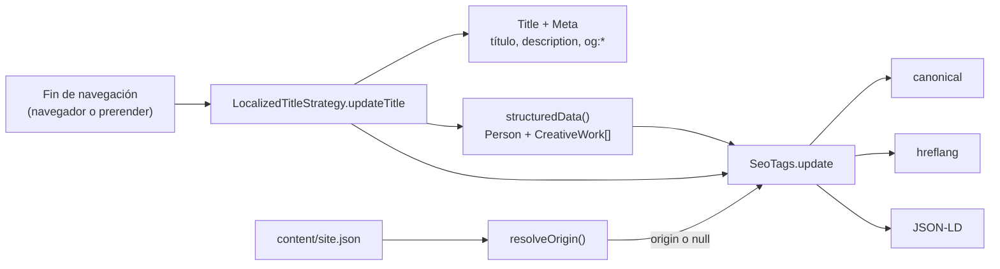

# SEO y metadatos

Un portafolio sirve de poco si no aparece bien en buscadores ni se ve bien al compartirlo. El proyecto cubre esto en tres momentos: en el HTML base, en cada navegación y después del build.

## Qué lleva cada página

| Elemento                                                          | Origen                                          | Ejemplo en `/en/projects/smartpos-pty`                     |
| ----------------------------------------------------------------- | ----------------------------------------------- | ---------------------------------------------------------- |
| `<html lang>`                                                     | `LanguageService.commit`                        | `en`                                                       |
| `<title>`                                                         | `LocalizedTitleStrategy`                        | `SmartPOS Pty · Project detail — Joel Guerrero`            |
| `meta[name=description]`                                          | `LocalizedTitleStrategy`                        | Texto `posDetail` en inglés                                |
| `og:title`, `og:description`, `og:type`, `og:locale`              | `LocalizedTitleStrategy`                        | Igual que título y descripción; `website`; `en`            |
| `og:site_name`, `twitter:card`, `robots`, `author`, `theme-color` | `src/index.html` (fijos)                        | —                                                          |
| `<link rel=canonical>`                                            | `SeoTags`                                       | `https://portfolio-1a3e7.web.app/en/projects/smartpos-pty` |
| `<link rel=alternate hreflang>` × 4                               | `SeoTags`                                       | `es`, `en`, `pt` y `x-default` → `/es/…`                   |
| `<script type=application/ld+json>`                               | `SeoTags` con datos de `LocalizedTitleStrategy` | `Person` + `CreativeWork` del proyecto                     |

Como todo se ejecuta durante el prerender, estas etiquetas ya están en el HTML estático que reciben los rastreadores. No dependen de que el JavaScript se ejecute.

## Flujo

## Datos estructurados (JSON-LD)

Se publica un `@graph` de schema.org:

- **`Person`** en todas las páginas: nombre, cargo, correo (`mailto:`), dirección (localidad tomada de la parte antes de la coma en `profile.location`, país `PA`) y `sameAs` con las redes que tienen URL. Si hay origen, también `@id` (`<origen>/<idioma>#person`) y `url`.
- **`CreativeWork`** en `/projects` (uno por proyecto) y en el detalle (solo el proyecto actual): nombre, descripción traducida, `creativeWorkStatus` (`Published` o `In development`), idioma, autor (referencia al `@id` de la persona si hay origen) y `sameAs` con demo y repositorio si existen.

Todo sale de datos confirmados en `content/`. `seo.spec.ts` verifica que no se añadan campos inventados.

## Cuando no hay dominio

Si `content/site.json` tiene `origin` y `firebaseProjectId` vacíos, `resolveOrigin` devuelve `null` y:

- No se emite `canonical`.
- No se emiten `hreflang`.
- El JSON-LD se publica sin `@id` ni `url`.
- `postbuild` genera `robots.txt` sin línea `Sitemap:` y **borra** cualquier `sitemap.xml` previo.

La razón está escrita en la nota del propio `site.json`: una URL canónica equivocada es peor que ninguna, porque le dice a Google que la página "de verdad" está en otro sitio.

## `robots.txt` y `sitemap.xml`

Los genera `tools/seo/generate-sitemap.mjs` como `postbuild`, recorriendo `dist/portfolio/browser`:

- Cada carpeta con un `index.html` es una URL del sitemap.
- Las carpetas `not-found` se excluyen.
- La raíz `/` no aparece, porque la raíz de `dist` no es una carpeta hija; tampoco hace falta, ya que solo redirige a `/es`.
- `robots.txt` permite todo (`Allow: /`) y apunta al sitemap si hay origen.

Resultado actual: 24 URLs (8 páginas indexables × 3 idiomas).

## Tests

- `core/seo.spec.ts`: canonical y hreflang con origen, ausencia sin origen y contenido del JSON-LD.
- `tools/seo/sitemap.test.mjs`: `resolveOrigin` (sin origen, desde el id de Firebase, origen explícito, rechazo de HTTP e ids inválidos), URLs absolutas del XML y línea `Sitemap:` de `robots.txt`. El recorrido de carpetas (`prerenderedRoutes`) no tiene test propio.
- `tools/i18n/check-prerender.mjs`: sobre el HTML real del build comprueba título, descripción y `og:*` de las 27 páginas.

## `resolveOrigin` está duplicado

Existe en `src/app/domain/site.ts` (para la app) y en `tools/seo/sitemap.mjs` (para el script). Son idénticos. Se duplicó porque los scripts de `tools/` son JavaScript puro que Node ejecuta directamente, sin compilar TypeScript. Si cambias uno, cambia el otro. Está anotado en [Deuda técnica](16-deuda-tecnica.md).
