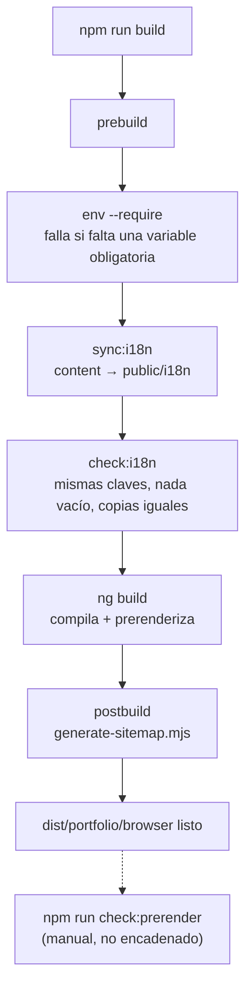

# Herramientas y scripts

`tools/` contiene scripts Node en formato ESM (`.mjs`). No se compilan: Node los ejecuta directamente. Cada carpeta separa la lógica pura (un módulo que exporta funciones, fácil de probar) del script que la ejecuta sobre archivos reales.

## Scripts de `package.json`

| Script            | Comando                                        | Qué hace                                                                  |
| ----------------- | ---------------------------------------------- | ------------------------------------------------------------------------- |
| `start`           | `ng serve`                                     | Servidor de desarrollo en `http://localhost:4200`. Antes ejecuta `env`.   |
| `build`           | `ng build`                                     | Build de producción con prerender. Antes `prebuild`, después `postbuild`. |
| `watch`           | `ng build --watch --configuration development` | Recompila al guardar. Antes ejecuta `env`.                                |
| `test`            | `ng test --watch=false`                        | Vitest una vez. Antes ejecuta `env`.                                      |
| `test:watch`      | `ng test`                                      | Vitest en modo interactivo.                                               |
| `typecheck`       | `tsc --noEmit` sobre app y specs               | Comprobación de tipos sin compilar. Antes ejecuta `env`.                  |
| `lint`            | `eslint src`                                   | Lint de TypeScript y plantillas.                                          |
| `lint:styles`     | `stylelint "src/**/*.{scss,css}"`              | Lint de estilos.                                                          |
| `check:styles`    | `node tools/styles/check-styles.mjs`           | Contrato CSS completo.                                                    |
| `test:styles`     | `node --test tools/styles/*.test.mjs`          | Tests del contrato CSS.                                                   |
| `env`             | `node tools/env/generate-environment.mjs`      | Genera `src/environments/*.ts`.                                           |
| `sync:i18n`       | `check-i18n.mjs --sync`                        | Copia `content/*.json` a `public/i18n/` y valida.                         |
| `check:i18n`      | `check-i18n.mjs`                               | Valida los textos y que las copias estén al día.                          |
| `test:i18n`       | `node --test tools/i18n/*.test.mjs`            | Tests del validador de textos.                                            |
| `check:prerender` | `check-prerender.mjs`                          | Audita el HTML generado. Requiere haber hecho `build`.                    |
| `test:seo`        | `node --test tools/seo/*.test.mjs`             | Tests de sitemap y robots.                                                |
| `test:env`        | `node --test tools/env/*.test.mjs`             | Tests del generador de entorno.                                           |
| `format:check`    | `prettier --check …`                           | Comprueba formato de código, contenido, docs y configuración.             |

## Ciclo de vida del build

`check:prerender` no forma parte del build automático ni de los workflows de GitHub. Hay que lanzarlo a mano después del build.

## `tools/env/`

| Archivo                    | Contenido                                                                                                                                                                                                                            |
| -------------------------- | ------------------------------------------------------------------------------------------------------------------------------------------------------------------------------------------------------------------------------------ |
| `environment.mjs`          | `FIREBASE_VARIABLES` (nombre de variable, clave de config, si es obligatoria), `firebaseConfig(env, { strict })` y `environmentSource(config, { production })`.                                                                      |
| `generate-environment.mjs` | Carga `.env` si existe (con `process.loadEnvFile`, nativo de Node), llama a las funciones anteriores y escribe los dos archivos. Con `--require` falla si falta alguna variable obligatoria. Sin él, escribe valores vacíos y avisa. |
| `environment.test.mjs`     | 5 tests: mapeo de variables a la config, error por faltantes en modo estricto, aviso sin error en modo laxo, rechazo de caracteres de control y escapado de comillas.                                                                |

Detalles de seguridad del generador:

- Rechaza valores con caracteres de control (saltos de línea incluidos), que podrían romper el archivo generado.
- Escapa `\` y `'` al escribir el literal TypeScript, para que un valor no pueda cerrar la cadena e inyectar código.
- No imprime valores en consola, solo los nombres de las variables que faltan.

## `tools/i18n/`

| Archivo               | Contenido                                                                                                                          |
| --------------------- | ---------------------------------------------------------------------------------------------------------------------------------- |
| `catalog.mjs`         | `leaves()` aplana un objeto a pares `[clave.anidada, valor]`. `validateCatalog()` aplica las reglas de consistencia entre idiomas. |
| `check-i18n.mjs`      | Lee `content/*.json`, valida, opcionalmente sincroniza (`--sync`) y comprueba que `public/i18n` sea idéntico.                      |
| `check-prerender.mjs` | La auditoría más completa del proyecto. Ver abajo.                                                                                 |
| `catalog.test.mjs`    | 7 tests del validador.                                                                                                             |

### Qué comprueba `check-prerender.mjs`

Abre con jsdom cada uno de los 27 HTML generados y verifica, entre otras cosas:

- `lang`, `<title>`, `description`, `og:title` y `og:description` exactos para esa página e idioma.
- Que el `h1` contenga el título esperado.
- Que el enlace de descarga del CV exista, apunte al PDF y tenga su `aria-label`.
- Que el nombre accesible de cada control contenga su texto visible (criterio WCAG 2.5.3, _Label in Name_).
- Que los enlaces del selector de idioma conserven la sección.
- Que ningún enlace interno pierda el prefijo de idioma.
- Que no aparezcan claves sin traducir, `{{ }}` sin resolver ni `[object Object]`.
- Que todos los assets referenciados (`img`, `script`, `link`, CV) existan en `dist`.
- Que el tamaño real del CV coincida con `profile.json`.
- Comprobaciones específicas por página: enlaces confirmados de cada proyecto, estado "pendiente", `mailto` codificado, grupos de habilidades, "1 / 6" en el progreso, región `aria-live` de la terminal, línea de tiempo, datos del reclutador y del hero.

Es la última red antes de publicar: prueba lo que realmente se va a servir, no lo que se renderiza en un test.

## `tools/seo/`

| Archivo                | Contenido                                                                                                         |
| ---------------------- | ----------------------------------------------------------------------------------------------------------------- |
| `sitemap.mjs`          | `resolveOrigin`, `prerenderedRoutes(root)`, `sitemapXml(origin, routes)`, `robotsTxt(origin)`.                    |
| `generate-sitemap.mjs` | Lee `content/site.json`, recorre `dist/portfolio/browser` y escribe `robots.txt` y, si hay origen, `sitemap.xml`. |
| `sitemap.test.mjs`     | 6 tests sobre `resolveOrigin`, `sitemapXml` y `robotsTxt`.                                                        |

## `tools/styles/`

| Archivo                  | Contenido                                                                                                                                                    |
| ------------------------ | ------------------------------------------------------------------------------------------------------------------------------------------------------------ |
| `rem-flow-rule.mjs`      | Plugin de Stylelint `portfolio/rem-flow`. Ver [Estilos](11-estilos.md#3-reglas-finas-sobre-cada-unidad).                                                     |
| `check-styles.mjs`       | Ejecuta Stylelint, recorre `src/` con el AST de TypeScript y el parser de plantillas de `@angular/compiler`, y aplica las reglas de estructura del contrato. |
| `rem-flow-rule.test.mjs` | 24 casos: 4 que deben pasar y 20 que deben fallar.                                                                                                           |
