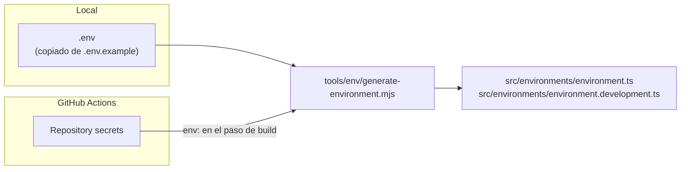

# Entorno y despliegue

## Variables de entorno

La configuración web de Firebase se inyecta como variables de entorno y se convierte en `src/environments/environment.ts` y `environment.development.ts` antes de compilar. Esos archivos no se versionan.

| Variable                       | Obligatoria | Clave generada      |
| ------------------------------ | ----------- | ------------------- |
| `FIREBASE_API_KEY`             | Sí          | `apiKey`            |
| `FIREBASE_AUTH_DOMAIN`         | Sí          | `authDomain`        |
| `FIREBASE_PROJECT_ID`          | Sí          | `projectId`         |
| `FIREBASE_STORAGE_BUCKET`      | Sí          | `storageBucket`     |
| `FIREBASE_MESSAGING_SENDER_ID` | Sí          | `messagingSenderId` |
| `FIREBASE_APP_ID`              | Sí          | `appId`             |
| `FIREBASE_MEASUREMENT_ID`      | No          | `measurementId`     |

Archivo generado:

```ts
export const environment = {
  production: true, // false en environment.development.ts
  firebaseConfig: {
    apiKey: "…",
    authDomain: "…",
    // …
  },
};
```



### En local

```bash
cp .env.example .env
# rellena los valores
```

`npm start`, `npm test`, `npm run typecheck` y `npm run watch` generan los archivos antes de ejecutarse. Si falta alguna variable, avisan pero continúan con valores vacíos. `npm run build` usa `--require` y se detiene.

### Importante: hoy la app no los usa

Ningún archivo de `src/` importa `environment` ni el SDK de `firebase`. La generación funciona y está probada, pero su resultado no se usa todavía. Parece preparada para una fase futura (Analytics, App Check, un formulario de contacto con Firestore…). Mientras tanto, el build exige variables que no afectan al resultado. Ver [Deuda técnica](16-deuda-tecnica.md).

### Sobre la "seguridad" de estas variables

La configuración web de Firebase no es secreta en el sentido estricto: cuando la app la use, acabará dentro del JavaScript público y cualquiera podrá leerla desde el navegador. Guardarla en secrets sirve para mantenerla fuera del historial de git y de los logs, no para ocultarla a los usuarios. La protección real vendrá de las restricciones de la API key en Google Cloud Console, de las reglas de seguridad de Firebase y de App Check.

## Firebase Hosting

### `.firebaserc`

Proyecto por defecto: `portfolio-1a3e7`.

### `firebase.json`

```json
{
  "hosting": {
    "public": "dist/portfolio/browser",
    "ignore": ["firebase.json", "**/.*", "**/node_modules/**"],
    "rewrites": [{ "source": "**", "destination": "/index.html" }]
  }
}
```

- **`public`**: la carpeta que genera el build.
- **`rewrites`**: Hosting sirve primero cualquier archivo estático que coincida con la URL (por ejemplo `/en/projects` → `en/projects/index.html`). Solo si no encuentra nada aplica la reescritura y entrega `/index.html`. Ese `index.html` es la página de redirección a `/es` que genera el prerender de la raíz. En la práctica, una URL inexistente acaba en la portada en español, no en la página 404. Ver [Deuda técnica](16-deuda-tecnica.md).

No hay configuración de cabeceras de caché ni de seguridad (`headers`). Hosting aplica sus valores por defecto.

### Despliegue manual

```bash
npm run build
npx firebase-tools deploy --only hosting
```

Requiere haber iniciado sesión con `npx firebase-tools login` y tener permisos sobre el proyecto.

## GitHub Actions

Hay dos workflows en `.github/workflows/`, casi idénticos:

```mermaid
flowchart TD
    subgraph merge["firebase-hosting-merge.yml"]
        M1["push a main"] --> M2["checkout + Node 24 + caché npm"]
        M2 --> M3["npm ci"]
        M3 --> M4["npm run build<br/>con secrets como env"]
        M4 --> M5["action-hosting-deploy<br/>channelId: live"]
    end
    subgraph pr["firebase-hosting-pull-request.yml"]
        P1["pull_request<br/>solo si la rama es del mismo repo"] --> P2["checkout + Node 24 + caché npm"]
        P2 --> P3["npm ci"]
        P3 --> P4["npm run build<br/>con secrets como env"]
        P4 --> P5["action-hosting-deploy<br/>canal de previsualización"]
        P5 --> P6["Comentario en el PR con la URL"]
    end
```



| Detalle            | `merge`                                     | `pull-request`                                                                                                               |
| ------------------ | ------------------------------------------- | ---------------------------------------------------------------------------------------------------------------------------- |
| Disparador         | `push` a `main`                             | Cualquier `pull_request`                                                                                                     |
| Condición          | —                                           | `head.repo.full_name == github.repository`. Los PR desde forks no se construyen, porque no deben tener acceso a los secrets. |
| Concurrencia       | Grupo `firebase-hosting-live`, sin cancelar | Grupo por número de PR, cancela la ejecución anterior                                                                        |
| Permisos del token | `checks: write`, `contents: read`           | Además `pull-requests: write` para comentar                                                                                  |
| Canal              | `live` (producción)                         | Uno temporal por PR                                                                                                          |

### Secrets necesarios

En **Settings → Secrets and variables → Actions** del repositorio:

- Las siete `FIREBASE_*` de la tabla de arriba.
- `FIREBASE_SERVICE_ACCOUNT_PORTFOLIO_1A3E7`: JSON de una cuenta de servicio con permiso para desplegar en Hosting. Lo crea `firebase init hosting:github` o se genera desde Google Cloud Console.

`GITHUB_TOKEN` lo proporciona GitHub automáticamente.

### Lo que el CI no hace

Los workflows solo instalan y construyen. No ejecutan tests, lint, typecheck, `check:styles`, `format:check` ni `check:prerender`. Un cambio que rompa un test se desplegaría igualmente si el build compila. Añadir esos pasos antes del despliegue es la mejora más barata y con más impacto que tiene el proyecto ahora mismo.
